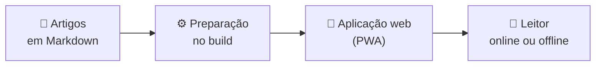

<div align="center">


# 📚 SST FAQ — Base de Conhecimento

**O conhecimento do time sobre Saúde e Segurança do Trabalho, reunido em um só lugar, com busca rápida e acesso offline.**


</div>

---

## 📌 O que é este projeto?

O **SST FAQ** é um portal de consulta que reúne a documentação interna de uma equipe sobre **Saúde e Segurança do Trabalho (SST)**: eventos do eSocial (S-2210, S-2220 e S-2240), Normas Regulamentadoras (NRs) e rotinas previdenciárias.

Em vez de depender de explicações orais ou de arquivos espalhados, o time encontra a resposta em um único lugar, pesquisando por termo ou navegando pelos artigos.

<!-- 
> **Nota:** esta é uma documentação de apresentação. Os detalhes técnicos serão detalhados em uma etapa posterior, após a validação contra o código-fonte.
-->

---

## 📖 A origem do projeto

A **Base de Conhecimento** nasceu de uma dor operacional que percebi nos meus primeiros meses de estágio. Em uma software house em franco crescimento, a cultura e os processos eram transmitidos quase exclusivamente de forma oral.

### 🔊 O problema

Sem um lugar único para consultar, o conhecimento ficava na cabeça das pessoas. Isso gerava:

- ruídos de comunicação entre os membros do time;
- impacto nos tempos de resposta (SLA);
- dificuldade para integrar novos colaboradores.

### 🧭 A iniciativa

Ao identificar essa barreira, tomei a iniciativa de documentar e mapear os fluxos de trabalho. A otimização foi tão expressiva que impulsionou a minha promoção à liderança da equipe de treinamento.

### 🤝 Do documento ao portal

A partir daí, passamos a documentar o conhecimento de forma colaborativa com o time. O volume de material gerado foi tão rico que exigiu a criação de um portal centralizado, e é aí que nasce o SST FAQ.

### 💭 A ideia por trás do portal

- **Conteúdo como código:** os artigos são arquivos Markdown versionados no Git, com histórico de todas as alterações.
- **Sem infraestrutura complexa:** a leitura dos artigos não depende de um banco de dados complexo.
- **Consulta em qualquer lugar:** a aplicação funciona em qualquer dispositivo e pode ser usada offline.
- **Resposta rápida:** uma busca local, que tolera erros de digitação, leva o time ao artigo certo.

### 🌟 Hoje

A plataforma é o coração operacional da equipe. Ela centraliza as orientações de SST, apoia o onboarding e contribui para reduzir erros e a rotatividade (*turnover*) do time.

> Idealizado e arquitetado por mim, com a parceria essencial de [Guilherme Cruz](https://github.com/https-shini), no apoio ao desenvolvimento, e de [João Sanches](https://github.com/Juao-crtl-c), na curadoria minuciosa do conteúdo. Conheça a equipe em [Créditos](#-créditos).

---

## ✨ Principais funcionalidades

- 🔎 **Busca tolerante a erros**  
  Pesquisa local com índice pré-compilado, que aceita erros de digitação e acentuação.

- ⌨️ **Navegação por teclado**  
  Command palette global acionada por `Ctrl+K` / `Cmd+K`.

- 📖 **Leitura confortável**  
  Artigos em Markdown, com tipografia própria e tooltips de glossário inseridos automaticamente.

- 📋 **Fila de leitura**  
  Página dedicada (`/minha-lista`) para organizar o que ler.

- 🌗 **Tema claro e escuro**  
  Alternância global aplicada a textos, bordas e fundos.

- 📴 **Funcionamento offline**  
  Instalável como PWA, com cache de bibliotecas, fontes e artigos.

- 🔗 **Links com pré-visualização**  
  Metadados OpenGraph e Twitter Cards para compartilhar artigos.

- 🛠️ **Área administrativa**  
  Login, listagem de artigos e editor para quem mantém o conteúdo.

- ♿ **Acessibilidade**  
  Tags semânticas e uso do teclado (Enter, Espaço e Esc).

---

## 🧭 Como é a experiência de uso

1. **Acessar** o portal, no computador ou no celular.
2. **Buscar** um assunto digitando na busca ou abrindo a command palette com `Ctrl+K`.
3. **Ler** o artigo, com termos técnicos explicados por tooltips de glossário.
4. **Continuar** por artigos relacionados ou pelo próximo da sequência.
5. **Guardar** o que ficou para depois na fila de leitura.
6. **Consultar offline**, depois que o conteúdo foi carregado e armazenado em cache.

<!-- TODO: adicionar screenshots da interface em uma seção "🖼️ Interface" quando as imagens estiverem disponíveis no repositório. -->

---

## 💼 Casos de uso

| Situação | Como o portal ajuda |
| :-- | :-- |
| 🧑‍🎓 **Onboarding** | Novos colaboradores consultam processos e normas por conta própria, sem depender de explicação oral. |
| ⚡ **Dúvida do dia a dia** | O time busca um evento do eSocial ou uma NR e chega ao artigo em poucos passos. |
| ✍️ **Manutenção do conteúdo** | Quem cuida da documentação edita e organiza os artigos pela área administrativa. |

---

## 🧩 Como o projeto funciona?

Os artigos são escritos em **Markdown** e versionados no Git (abordagem *content as code*). O conteúdo é preparado durante o build e carregado no navegador apenas quando o leitor abre cada artigo, sem depender de um banco de dados complexo.



---

## 👥 Para quem é?

- **Equipes** que precisam de uma fonte única de consulta sobre SST, eSocial e rotinas previdenciárias.
- **Novos colaboradores**, que precisam se localizar rápido em processos e normas.
- **Responsáveis pelo conteúdo**, que mantêm a documentação atualizada.

---

## 🛠️ Tecnologias principais

As versões são as declaradas na documentação anterior do projeto.

| Tecnologia | Utilização |
| :-- | :-- |
| **React 19.2** e **TypeScript 5.8** | Interface e tipagem |
| **Vite 6.2** | Build e empacotamento |
| **Tailwind CSS 4.1** | Estilos e tema claro/escuro |
| **Fuse.js** | Busca local |
| **Marked**, **DOMPurify** e **Gray-Matter** | Leitura e sanitização do Markdown |
| **CMDK**, **Framer Motion** e **Lenis** | Command palette, animações e rolagem |
| **Vite PWA (Workbox)** | Cache e funcionamento offline |
| **React Helmet Async** | Metadados para SEO e compartilhamento |

---

## 🚀 Como executar

**Pré-requisitos:** [Node.js](https://nodejs.org/) e npm.

```bash
git clone https://github.com/VictorCardosoOl/Base_de_Conhecimento1.git
cd Base_de_Conhecimento1
npm install
npm run dev
```

O endereço local é exibido no terminal ao iniciar o servidor.

Para gerar a versão de produção:

```bash
npm run build
```

---

## 🗺️ Rotas principais

| Rota | O que é |
| :-- | :-- |
| `/` | Início, com listagem de artigos e busca |
| `/minha-lista` | Fila de leitura |
| `/artigo/:id` | Acesso direto a um artigo |
| `/login` | Login do administrador |
| `/admin` | Painel administrativo |
| `/admin/editor` | Editor de artigos |

---

## 🤝 Contribuição

Contribuições são bem-vindas, seja para melhorar o conteúdo, corrigir um erro ou evoluir a aplicação.

### Formas de contribuir

| Tipo | Exemplos |
| :-- | :-- |
| 📝 **Conteúdo** | Criar um artigo, atualizar uma orientação, corrigir um texto ou termo do glossário |
| 🐛 **Correções** | Reportar ou corrigir um problema encontrado durante o uso |
| 💡 **Melhorias** | Sugerir ou implementar ajustes de interface, acessibilidade ou usabilidade |

### Passo a passo

1. **Faça um fork** do repositório e clone-o na sua máquina.
2. **Crie uma branch** para a sua alteração, com um nome que descreva o objetivo:

   ```bash
   git checkout -b minha-contribuicao
   ```

3. **Faça as alterações.** Os artigos são arquivos Markdown, processados durante o build pelo script `scripts/generate-catalog.js`.
4. **Valide localmente** com o ambiente de desenvolvimento e confira se o resultado aparece como esperado:

   ```bash
   npm install
   npm run dev
   ```

5. **Faça o commit** com uma mensagem curta e clara sobre o que mudou.
6. **Envie a branch** e **abra um Pull Request** descrevendo o que foi alterado e por quê.

> **Dica:** em alterações de conteúdo, descreva no Pull Request qual artigo foi criado ou modificado. Isso facilita a revisão.

<!-- TODO: linkar o guia de contribuição (./CONTRIBUTING.md) assim que a existência do arquivo for confirmada no repositório. Se ele definir um padrão de commits, referenciá-lo no passo 5. -->

---

## 👏 Créditos

O SST FAQ não é obra de uma pessoa só. Ele existe porque alguém quis resolver um problema real, outros se juntaram para construir a solução e o time inteiro ajudou a transformar o dia a dia em documentação.

### 👥 Equipe

<table align="center">
  <tr>
    <td align="center" width="260">
      <a href="https://github.com/VictorCardosoOl">
        
      </a>
      <br /><br />
      <strong>Victor Cardoso Cunha</strong>
      <br />
      <sub>Idealização e arquitetura</sub>
      <br /><br />
      <sub>Identificou o problema, iniciou a documentação dos fluxos de trabalho e projetou o portal.</sub>
      <br /><br />
      <a href="https://github.com/VictorCardosoOl">GitHub</a> ·
      <a href="https://linkedin.com/in/victorcardosocunha">LinkedIn</a>
    </td>
    <td align="center" width="260">
      <a href="https://github.com/https-shini">
        
      </a>
      <br /><br />
      <strong>Guilherme Cruz</strong>
      <br />
      <sub>Desenvolvimento</sub>
      <br /><br />
      <sub>Apoiou a construção da aplicação ao longo do desenvolvimento.</sub>
      <br /><br />
      <a href="https://gcruz.dev.br">Portfólio</a> ·
      <a href="https://github.com/https-shini">GitHub</a>
    </td>
    <td align="center" width="260">
      <a href="https://github.com/Juao-crtl-c">
        
      </a>
      <br /><br />
      <strong>João Sanches</strong>
      <br />
      <sub>Curadoria de conteúdo</sub>
      <br /><br />
      <sub>Revisou e organizou o material técnico publicado no portal.</sub>
      <br /><br />
      <a href="https://github.com/Juao-crtl-c">GitHub</a>
    </td>
  </tr>
</table>

### 🌱 Como tudo começou

| Etapa | O que aconteceu |
| :-- | :-- |
| **1. Percepção** | Nos primeiros meses de estágio, Victor notou que processos e cultura da equipe passavam quase só pela comunicação oral. |
| **2. Iniciativa** | Ele começou a documentar e mapear os fluxos de trabalho, o que impulsionou sua ida para a liderança da equipe de treinamento. |
| **3. Colaboração** | O time passou a documentar o conhecimento em conjunto, e o volume de material justificou um portal próprio. |
| **4. Portal** | O SST FAQ nasceu para centralizar esse conhecimento e servir de apoio à rotina da equipe. |

### 🙏 Agradecimentos

- Ao **time da software house**, que participou da documentação colaborativa e deu origem ao conteúdo publicado no portal.
- Aos **mantenedores dos projetos de código aberto** que sustentam a aplicação, listados em [Tecnologias principais](#️-tecnologias-principais).
- A **quem contribui** com artigos, correções e sugestões, conforme descrito em [Contribuição](#-contribuição).

### 📬 Contato

Dúvidas, sugestões ou propostas de colaboração:

[](https://linkedin.com/in/victorcardosocunha)
<br>
[](https://github.com/VictorCardosoOl)

---

<div align="center">

Feito com 💚 — conhecimento do time simples de encontrar, mesmo offline.

⭐ Se gostou, deixe uma estrela no repositório!


</div>
